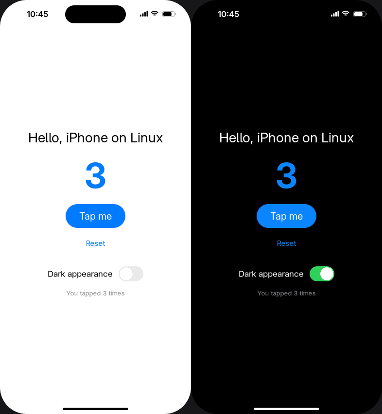
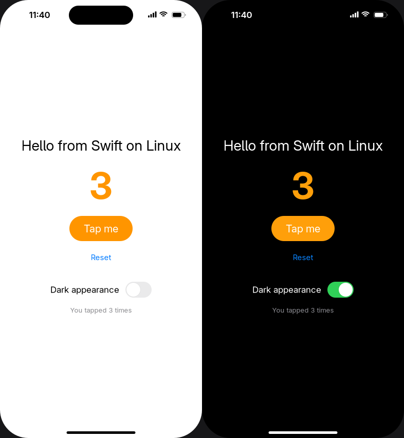
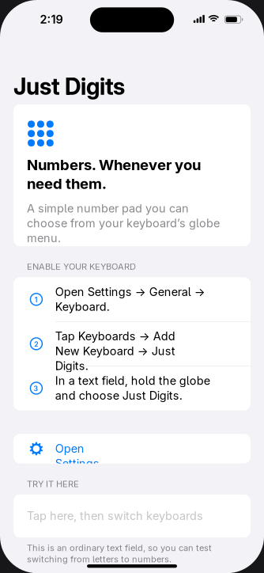
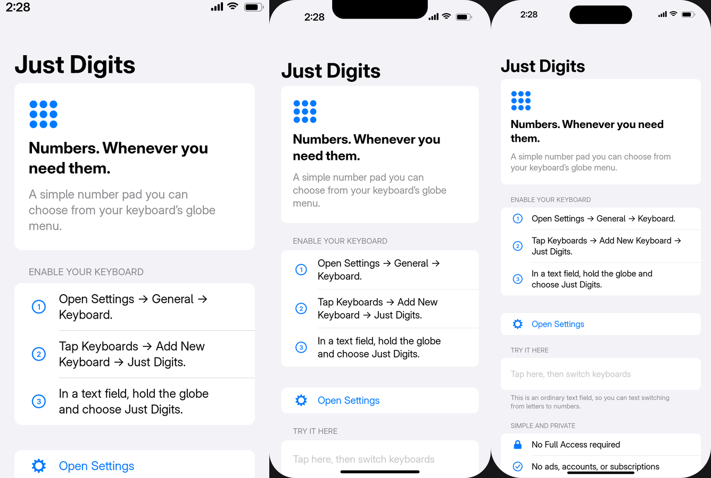
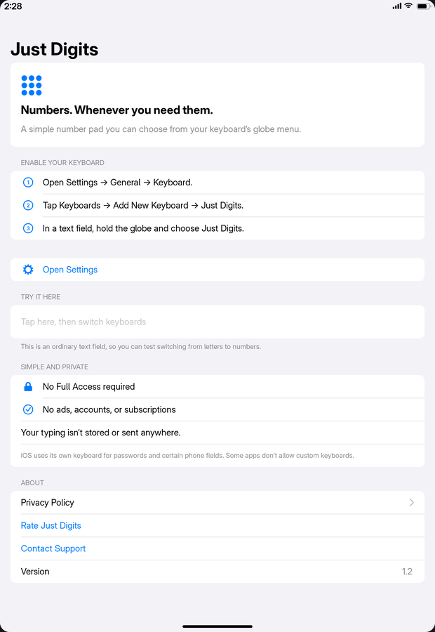

# isim — iOS development on Linux

Write code → compile → run in a local iOS-compatible simulator → build for iPhone/iPad →
sign → package → upload to App Store Connect, **entirely on Linux** (no macOS machine, VM,
remote Mac or Mac CI). Apps in **Objective-C and Swift**, with UIKit and **SwiftUI**, and a simulator that feels like an
iPhone: a **home screen** with the installed apps and a **Settings** app whose pages replicate iOS
Settings as each setting (language, region, appearance, text size, keyboards, …) is implemented.

**Acceptance test:** the same sample app runs in our Linux simulator, is built and signed on
Linux, uploaded from Linux, and installs on an iPhone through TestFlight. (App Review is a
separate outcome.)

---

## Progress

_Last updated: 2026-10-05._ Legend: ✅ done and verified · 🟡 in progress / partial · ⬜ not started · ⛔ blocked

### Overall

| Stage | Status | Evidence / notes |
|---|---|---|
| 1. Compile for iOS targets on Linux | ✅ | clang/lld 22.1.8 produce iOS-simulator (x86_64) and iOS (arm64) Mach-O objects and executables — `results/01-probe.txt`, `experiments/02-link` |
| 2. Run iOS-simulator binaries on Linux | ✅ | own loader + runtime (`isim/runtime`); C, threads, ObjC, Foundation self-test 32/32 |
| 3. Simulator UI: boilerplate UIKit app in a window | ✅ | Xcode-template ObjC app (`isim/samples/HelloCounter`) runs in a Wayland window on this machine; UI test 9/9 |
| 4a. Swift (Embedded) on the simulator | ✅ | own Embedded stdlib build for `x86_64-apple-ios-simulator`; Swift self-test 11/11 on isim — `isim/swift/` |
| 4b. Swift (full: runtime, ObjC interop, UIKit apps) | ✅ | Xcode-template **Swift UIKit app** (`isim/samples/HelloCounterSwift`) runs on isim; `libswiftCore` + **Swift Concurrency** (`async`/`await`, actors, `@MainActor`, 11/11) built on Linux; Swift↔Foundation bridging (28/28). Not yet: Regex — `docs/swift-plan.md` |
| 4c. SwiftUI | 🟡 | **isim re-implementation** (SwiftUI is closed source): views, `@State`/`@Binding`/`@FocusState`/`@Environment`, stacks, `Form`/`List`/`Section`, `NavigationStack`, `TextField`, toolbar, `.task`/`.onChange` — HelloSwiftUI UI test 10/10; **JustDigits runs** (below). Not yet: animations, sheets/alerts, `ScrollView`, `Grid`, `@Observable` |
| 4d. Simulator settings (language, region, appearance, text size, 12/24h, time zone, device) | 🟡 | set in the **Settings app** (4f) and stored as global preferences that every app reads (`$ISIM_DATA/Library/Preferences/.GlobalPreferences.plist`); environment variables still override. Not yet: text size, accessibility |
| 4e. Home screen (SpringBoard-like): installed apps, launch/quit, Settings icon | ✅ | `isim boot`: icon grid from asset catalogs + dock; every app is its own process (shared-memory surfaces); swipe up from the bottom edge goes home, apps resume from the background; long press → Edit Home Screen / Remove App → iOS delete alert. UI test `tests/ui/boot.sh`. Not yet: App Library, jiggle animation, folders, app switcher |
| 4f. Settings app replicating iOS Settings | 🟡 | SwiftUI app (`isim/system/Settings`): General › About, Date & Time (24-hour, time zone), Keyboard (Keyboards, Add New Keyboard, Auto-Capitalization), Language & Region; Display & Brightness › Light/Dark; per-app pages (keyboard toggles) with `UIApplication.openSettingsURLString` deep links. Pages are added as each setting is implemented |
| 4g. Multiple iPhone sizes | ✅ | `isim run --device …`: iPhone SE (home button), 13 mini & 14 (notch), 15 / 15 Plus / 15 Pro Max, 16 Pro / 16 Pro Max (Dynamic Island) — safe areas, corner radii, status bar. Not yet: landscape / rotation |
| 4h. iPad | 🟡 | iPad mini, Air 11", Pro 11", Pro 13" screens with regular size class. Not yet: iPad keyboard layout, readable-width form margins, sidebars/split views, rotation, multitasking (Split View, Slide Over, Stage Manager), pointer |
| 4i. Multiple iOS versions | ⬜ | goal: `--os 17|18|…` selects the reported version (`UIDevice.systemVersion`, `#available`) **and** that version's look; today: iOS 17/18 style, `ISIM_OS_VERSION` (default 18.0) for availability checks |
| 4j. Xcode-like project view (open project, build, run) | ⬜ | goal; the CLI covers it today: `isim build -project … && isim install … && isim boot` |
| 4k. Linux releases | 🟡 | `isim/release/package.sh` → self-contained `isim-VER-linux-x86_64.tar.gz` (runtime built on Ubuntu 22.04 / glibc 2.35, libraries bundled, SDK + demo apps); verified on CachyOS and a clean Fedora 41 container. Published on GitHub Releases per feature milestone |
| ✅ Real app: **JustDigits** (`../numpad`, SwiftUI + custom keyboard) | ✅ | built unmodified with `isim build` (pbxproj, string catalogs, assets, embedded `.appex`); setup screen, test field, the app's keyboard via the globe menu (loaded in-process), Privacy Policy push/back, review prompt, links |
| 5. Device build (arm64 .app) | 🟡 | arm64 executables link; code signature, resources, bundle not done |
| 6. Signing + .ipa | ⬜ | candidate tools identified (rcodesign, zsign) — `docs/distribution-research.md` |
| Real app: **Mazefall** (`../mazefall`, SwiftUI + SpriteKit, AVFoundation, GameKit, StoreKit, ads SDK, Swift package) | ⬜ | next real app; needs SpriteKit, AVFoundation, GameKit, Combine, Swift packages, binary SDK stubs |
| 7. Upload from Linux | ⬜ | Build Upload API flow documented; untested; needs your Apple account later |
| 8. TestFlight install on iPhone | ⛔ | blocked by the policy items below |

### Simulator compatibility (what runs today)

| Area | Status | Notes |
|---|---|---|
| Mach-O loading (exec + dylibs, chained fixups, legacy binds, export tries, rpaths) | ✅ | refuses non-iOS-simulator binaries |
| libSystem subset (libc, pthreads with Darwin layouts, time, errno) | ✅ | passthrough vs adapted vs stub labelled per symbol |
| Objective-C runtime (dispatch, categories, ivar sliding, +initialize, ARC, weak, blocks) | ✅ | no exceptions, no forwarding, no tagged pointers |
| Foundation subset (strings, collections, numbers, bundle/Info.plist + localization, locale/formatters, URL/FileManager, timers, run loop, libdispatch subset, notifications, operation queues) | ✅ | persisted NSUserDefaults; XML plists only |
| CoreGraphics subset (geometry, colors, simple context drawing) | ✅ | |
| UIKit: app/scene lifecycle, views, labels, buttons, switches, stack views, **Auto Layout (Cassowary solver)**, images + SF Symbol substitutes, scroll views, text fields, gestures (tap/pan/long press), light/dark | ✅ | subset, usable from Objective-C and Swift — see `docs/compatibility-matrix.md` |
| System keyboard + **custom keyboard extensions** (preview host; in-app via the globe menu) | ✅ | QWERTY/number layers, auto-capitalization, return key types; extensions loaded in-process |
| Rendering + input (SDL3 window on Wayland, cairo/pango software rendering, device chrome) | ✅ | mouse = single touch; headless scripted mode for tests |
| Tables/collection views, UIKit navigation/tab controllers, alerts, real animations, storyboards | ⬜ | next UIKit milestones |
| WebKit, Metal | ⬜ | later investigations, not promised |

### Distribution blockers (from `docs/distribution-research.md`)

1. ⛔ **Apple SDK license:** the Xcode/SDK agreement allows use only on Apple-branded hardware, so isim uses a **self-authored SDK** (headers + stubs) instead of Apple's.
2. ⛔ **"Built with Xcode 26+ / iOS 26 SDK" upload rule:** a non-Xcode build can't honestly claim this, and we will not fake SDK/Xcode metadata. The only legitimate path found is written permission from Apple.
3. 🟡 Unproven: whether Apple accepts Linux-produced `Assets.car`, signatures, and the `AppStoreInfo.plist` asset description.




_The Xcode App template (Objective-C, top; Swift, bottom) plus a small counter UI, compiled on Linux and rendered by isim (left: after three taps; right: dark appearance)._



_JustDigits, a real SwiftUI app with a custom keyboard extension, built from its Xcode project on Linux with `isim build` and running on isim's SwiftUI._




### Can isim support SwiftUI?

Yes, but only by **re-implementing** it, the same way isim re-implements UIKit: SwiftUI is a closed-source
Apple framework, so its binaries can't be used. A compatible implementation needs (1) the full Swift runtime
(stage 4b — SwiftUI leans on generic metadata, opaque result types, result builders, property wrappers and
Observation), and (2) a SwiftUI-compatible framework rendering through isim's UIKit/renderer. Existing
open-source SwiftUI re-implementations (e.g. OpenSwiftUI, Tokamak) are candidates to evaluate as a base
(licenses and completeness not yet checked). Note that Xcode's default new-project template is SwiftUI, so
this matters for "boilerplate app" fidelity. Status: planned after 4b, not promised.

### Next steps

1. Swift: `_Concurrency` (async/await, `@MainActor`) and `_StringProcessing` (Regex); more API-notes fidelity for Swift names.
2. Simulator settings: language/region/appearance/text size via device profiles and `isim run` flags.
3. UIKit breadth: UIScrollView, UITableView, UINavigationController, UITextField + keyboard, UIImage decoding, real animations.
4. Device: ad-hoc code signature + `.app` bundle for arm64; then distribution signing experiments.
5. Storyboard support (a Linux storyboard compiler) so the unmodified Xcode template works.

---

## Repository layout

| Path | What |
|---|---|
| `isim/` | the simulator: `runtime/` (Linux host: loader, libSystem, ObjC runtime, window/rendering), `sdk-src/` (self-authored iOS SDK headers), `frameworks/` (Foundation, CoreGraphics, UIKit implementations compiled as iOS-simulator Mach-O), `tests/`, `samples/`, `build.sh` |
| `experiments/` | numbered research experiments with their scripts (02 link, 03 loader, 04 Darling, 05 ObjC, 06 Swift) |
| `docs/` | compatibility matrix, research reports (Darling evaluation, distribution research, Swift plan) |
| `results/` | captured outputs of experiments |
| `probe.sh`, `probe.c` | the original object-generation probe |

## How to use isim

### Run it without building anything (release)

Download `isim-VERSION-linux-x86_64.tar.gz` from [GitHub Releases](https://github.com/kolabs-dev/isim/releases)
(Linux x86_64, glibc 2.35+; needs `python3`, fontconfig and `adwaita-icon-theme`):

```bash
tar xf isim-0.1.0-linux-x86_64.tar.gz
```

```bash
isim-0.1.0-linux-x86_64/bin/isim boot
```

This opens the simulated iPhone on its home screen with the Settings app; no app needs to be
built or installed. To add the bundled demo apps:

```bash
isim-0.1.0-linux-x86_64/bin/isim install isim-0.1.0-linux-x86_64/apps/*.app
```

### Build from source

Requirements (Arch/CachyOS): `clang`, `lld`, `llvm`, `sdl3`, `cairo`, `pango`, `librsvg`, `python`, `rsync`,
`imagemagick`, Docker (Swift parts use the `swift:6.2` image).

```bash
isim/build.sh
```

```bash
isim/test.sh
```

The commands below use `isim/out/bin/isim` (from a release: `bin/isim`).

### On the device

| Command | What |
|---|---|
| `isim boot` | start the device on its home screen (installed apps + Settings) |
| `isim install App.app…` / `isim uninstall NAME` / `isim apps` | manage installed apps |
| `isim run App.app` | run one app directly, without the home screen |
| `isim reset` | erase installed apps, app data and settings |
| `isim build -project App.xcodeproj [-target T] [-o DIR]` | build an Xcode project (pbxproj, Swift/ObjC, asset catalogs, string catalogs, app extensions) |
| `isim cc …` / `isim swiftc …` | compile single files for the isim SDK (`ISIM_MIN_IOS`, default 17.0) |
| `isim info App.app` | Mach-O platform and dependencies |

Device options for `boot`/`run`: `--device iphonese|iphone13mini|iphone14|iphone15|iphone15plus|iphone15promax|iphone16pro|iphone16promax|ipadmini|ipadair11|ipadpro11|ipadpro13`,
`--zoom 0.8`, `--dark`, `--headless --script "…"`.

Interaction: click = touch, drag = swipe, swipe up from the bottom edge (or Ctrl+Shift+H) = home,
press and hold an icon = Edit Home Screen / Remove App, F12 = screenshot. Settings live in the Settings app;
data lives in `~/.local/share/isim` (`ISIM_DATA`).

Scripts (automation/tests): `wait S`, `tap X Y`, `tapid ID`, `taptext TEXT`, `holdid ID`, `type TEXT`, `key NAME`,
`home`, `launch BUNDLE_ID`, `shot FILE.png`, `dump`, `quit` — e.g.
`isim boot --headless --script "wait 2; launch dev.isim.settings; wait 1; shot s.png; quit"`.

### Make a release

```bash
isim/release/package.sh 0.1.0
```

Builds the runtime in an Ubuntu 22.04 container (`isim/release/Dockerfile`) and writes `dist/isim-0.1.0-linux-x86_64.tar.gz` + `.sha256`.

## Environment (verified 2026-10-05)

CachyOS, kernel 7.2.7-1-cachyos, Intel Core Ultra 9 275HX (24 cores, x86-64), 30 GiB RAM,
NVIDIA RTX 5070 Laptop (driver 615.71.09), GNOME on Wayland, clang/lld 22.1.8, Python 3.14.7.
~11 GB free on `/`.

## Decisions

- **Runtime:** dedicated compatibility layer (own loader + ObjC runtime + framework subset), not Darling.
  Darling (pinned `60ba801`) runs our simulator binaries only after relabelling its macOS libraries,
  has no UIKit, and needs a privileged GPL-3.0 multi-GB stack. It remains a reference — `docs/darling-evaluation.md`.
- **No Apple SDK or Apple binaries** are used or redistributed. `LC_BUILD_VERSION` records `sdk n/a`.
- **Honesty rules:** never retarget a binary to macOS/Linux and call it iOS compatibility; never fake
  SDK/Xcode metadata; label every runtime symbol as passthrough / adapted / isim / stub.
- CLI first, C/ObjC first, software rendering first. Swift is a first-class goal; SwiftUI/WebKit/Metal are later.
- Signing keys and API credentials stay local and out of the repo (`.gitignore` blocks common key/profile files).

## References

- LLVM Mach-O linker: https://lld.llvm.org/MachO/index.html
- Darling: https://github.com/darlinghq/darling
- touchHLE: https://github.com/touchHLE/touchHLE
- Apple simulator architecture (WWDC19 418): https://developer.apple.com/videos/play/wwdc2019/418/
- Build Upload API: https://developer.apple.com/documentation/appstoreconnectapi/post-v1-builduploads
- Upload workflow: https://developer.apple.com/help/app-store-connect/manage-builds/upload-builds
