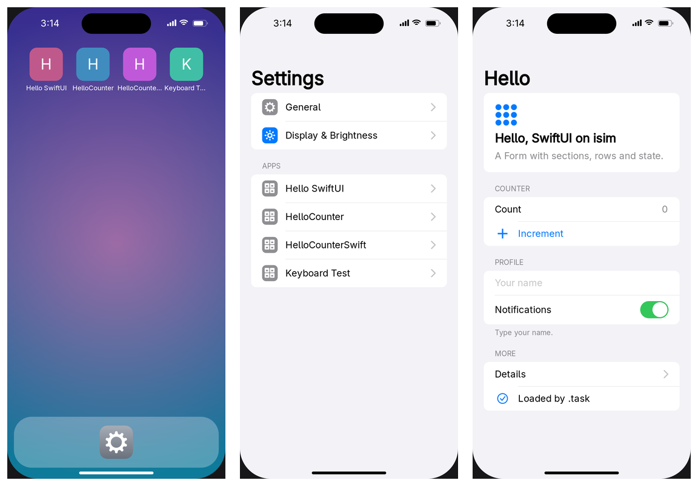

# isim — iOS development on Linux

An iOS-compatible simulator and toolchain that runs on Linux, with no macOS, VM or remote Mac.
It builds Objective-C and Swift apps (UIKit and SwiftUI) from their Xcode projects and runs them
on a simulated iPhone or iPad with a home screen and a Settings app.

Goal: write → build → run in the simulator → device build → sign → upload → TestFlight, all on Linux.



## Quick start (no build needed)

Download `isim-VERSION-linux-x86_64.tar.gz` from [Releases](https://github.com/kolabs-dev/isim/releases).
It needs Linux x86_64 with glibc 2.35+, plus `python3`, fontconfig and `adwaita-icon-theme`.

```bash
tar xf isim-0.1.0-linux-x86_64.tar.gz
```

```bash
isim-0.1.0-linux-x86_64/bin/isim boot
```

This opens the device on its home screen, with Settings in the dock. To add the demo apps:

```bash
isim-0.1.0-linux-x86_64/bin/isim install isim-0.1.0-linux-x86_64/apps/*.app
```

## Usage

| Command | What |
|---|---|
| `isim boot` | start the device on its home screen |
| `isim install App.app…` · `isim uninstall NAME` · `isim apps` | manage installed apps |
| `isim run App.app` | run one app without the home screen |
| `isim reset` | erase installed apps, app data and settings |
| `isim build -project App.xcodeproj [-target T] [-o DIR]` | build an Xcode project |
| `isim cc …` · `isim swiftc …` | compile files for the isim SDK |
| `isim info App.app` | show Mach-O platform and dependencies |

**Options** for `boot` and `run`:
- `--device iphonese|iphone13mini|iphone14|iphone15|iphone15plus|iphone15promax|iphone16pro|iphone16promax|iphone17|iphoneair|iphone17pro|iphone17promax|ipadmini|ipadair11|ipadpro11|ipadpro13`
- `--zoom 0.8`
- `--dark`
- `--headless --script "…"`

**On the device:**
- Click to touch, drag to swipe.
- Swipe up from the bottom edge (or press Ctrl+Shift+H) to go home.
- Press and hold an icon to delete the app.
- F12 takes a screenshot.
- Device data lives in `~/.local/share/isim` (override with `ISIM_DATA`).

**Scripts** (for automation and tests) accept `wait S`, `tap X Y`, `tapid ID`, `taptext TEXT`, `holdid ID`,
`type TEXT`, `key NAME`, `home`, `launch BUNDLE_ID`, `shot FILE.png`, `dump` and `quit`. Example:

```bash
isim boot --headless --script "wait 2; launch dev.isim.settings; wait 1; shot s.png; quit"
```

**Compiling** needs clang/lld 17+. Swift needs Docker with the `swift:6.2` image.

## Build from source

Requirements (Arch/CachyOS): `clang`, `lld`, `llvm`, `sdl3`, `cairo`, `pango`, `librsvg`, `python`, `rsync`, `imagemagick`, Docker.

```bash
isim/build.sh
```

```bash
isim/test.sh
```

Tools are installed in `isim/out/bin`. To package a release into `isim/dist/` (the build runs in an Ubuntu 22.04 container):

```bash
isim/release/package.sh 0.1.0
```

## Status

Per-API progress (UIKit, SwiftUI, Foundation, StoreKit, Game Center, ...): [docs/COVERAGE.md](docs/COVERAGE.md) — after editing its rows, run `isim/tools/coverage-summary.py` to refresh the summary.

✅ done · 🟡 partial · ⬜ not started · ⛔ blocked

| Area | Status | Notes |
|---|---|---|
| Compile for iOS on Linux | ✅ | clang/lld produce iOS-simulator (x86_64) and device (arm64) Mach-O |
| Run simulator binaries | ✅ | own Mach-O loader, libSystem subset, Objective-C runtime, Foundation |
| UIKit | 🟡 | views, controls, Auto Layout, scroll views, text fields, keyboard and keyboard extensions, alerts. Not yet: table/collection views, animations, storyboards |
| Swift | ✅ | full runtime, Swift Concurrency, Regex / RegexBuilder, Foundation bridging |
| SwiftUI | 🟡 | isim's own implementation (SwiftUI is closed source): common views, state, Form/List, NavigationStack. Not yet: animations, sheets, ScrollView, Grid, `@Observable` |
| Home screen | ✅ | apps run as separate processes; home gesture; background/resume; delete apps. Not yet: App Library, app switcher |
| Settings app | 🟡 | General (About, Date & Time, Keyboard, Language & Region), Display & Brightness, per-app pages |
| Devices | 🟡 | 12 iPhones (SE to 17 Pro Max) and 4 iPads. Not yet: rotation, iPad multitasking |
| Multiple iOS versions | ⬜ | planned: `--os` picks the reported version and the look (today: iOS 17/18) |
| Xcode-like project view | ⬜ | planned; the CLI covers it today |
| Linux releases | ✅ | self-contained tarballs on GitHub Releases |
| Real app: JustDigits (SwiftUI + keyboard extension) | ✅ | built unmodified from its Xcode project |
| Real app: Mazefall (SwiftUI, SpriteKit, GameKit, StoreKit, ads) | 🟡 | in progress |
| Device build (arm64 .app) | 🟡 | executables link; bundle and signature not done |
| Signing + .ipa | ⬜ | candidates: rcodesign, zsign |
| Upload + TestFlight | ⛔ | see below |

API coverage details are in [docs/compatibility-matrix.md](docs/compatibility-matrix.md).

## Rules and limits

- **No Apple SDK or binaries.** isim ships a self-authored SDK, because the Xcode/SDK license restricts its use to Apple hardware.
- **No faked metadata.** Builds never claim Xcode or Apple SDK versions. Binaries are never retargeted to macOS or Linux and reported as iOS compatibility.
- **Upload is blocked.** The App Store requires builds made with a current Xcode/iOS SDK, which a Linux build cannot honestly claim. See [docs/distribution-research.md](docs/distribution-research.md).
- **Keys stay local.** Signing keys and API credentials stay on the machine, out of the repo.

## Repository layout

| Path | What |
|---|---|
| `isim/runtime` | Linux host: loader, libSystem, ObjC runtime, window, rendering, device shell |
| `isim/sdk-src`, `isim/frameworks`, `isim/swift` | SDK headers; Foundation, UIKit, …; Swift runtime and overlays (including SwiftUI) |
| `isim/system` | home screen (SpringBoard) and Settings apps |
| `isim/tools` | `isim` CLI and Xcode project builder |
| `isim/samples`, `isim/tests` | demo apps and test suites |
| `isim/release` | release packaging |
| `docs/` | research notes |

## License

Apache-2.0, see [LICENSE](LICENSE). Release packages include third-party licenses in `licenses/` ([isim/release/licenses](isim/release/licenses)).

## Trademarks

isim is an independent project. It is not affiliated with, endorsed by, or sponsored by Apple Inc.
Apple, iPhone, iPad, iOS, Xcode, Swift, UIKit, SwiftUI, TestFlight and App Store are trademarks of Apple Inc.,
used here only to describe compatibility.
